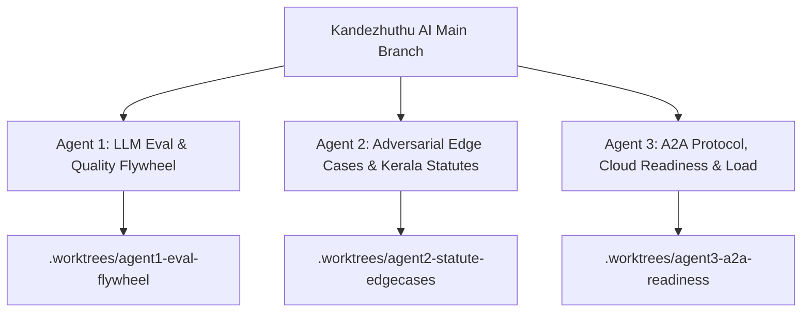

# Kandezhuthu AI (കണ്ടെഴുത്ത്) · Parallel Agent Testing Handover

**Date**: September 29, 2026  
**Status**: Core UI Overhaul, 8/8 Playwright Suites, Unit Tests, and Server E2E Tests Fully Stabilized & Passing.  
**Objective**: Divide remaining testing, validation, and evaluation across **3 parallel agents** operating in isolated git worktrees.

---

## 1. Current State & Baseline Health

| Test Suite / Layer | Status | Execution Command | Notes |
|---|---|---|---|
| **Deterministic Unit Tests** | ✅ **10/10 Passed** (1.62s) | `uv run pytest tests/unit/` | `test_munnadharam_auditor.py` & `test_single_deed_scanner.py` |
| **Integration & Server E2E** | ✅ **4/4 Passed** (28.38s) | `uv run pytest tests/integration/` | Uses isolated `TEST_PORT=8005` to avoid dev collisions |
| **Playwright Master UI Suites** | ✅ **8/8 Passed** | `uv run pytest tests/ui` (needs the web UI on :8081) | Dual-pane, HUD, Lineage, OCR, PDF, Cadastre & Bilingual |
| **UI Polish & Dropzone** | ✅ **Completed** | `frontend/static/index.html` | Minimized mode preserves quickstart buttons; instant geocoding |

---

## 2. Parallel Worktree Isolation Rules

Per project rules in `GEMINI.md`, each agent **MUST** work in its own isolated worktree under `.worktrees/`:
```bash
# Example setup for each agent from repository root:
git worktree add -b feat/<agent-task-name> .worktrees/<agent-task-name> HEAD
cd .worktrees/<agent-task-name>
```
- **Never modify code on `main` concurrently.**
- **Commit atomically** on each milestone.
- **Do not run tests without explicit user instructions** inside production workspaces.
- **Model constraint**: Keep `MODEL = "gemini-3.8-flash"` in `app/agent.py`.

---

## 3. Work Allocation for 3 Parallel Agents



---

### 🟢 Agent 1: LLM Response Quality & Evaluation Flywheel

**Branch / Worktree**: `.worktrees/agent1-eval-flywheel` (`feat/eval-quality-flywheel`)  
**Scope**: Response quality benchmarks, statutory accuracy, and disclaimer guardrail enforcement using `agents-cli eval`.

#### Tasks to Execute:
1. **Benchmark Eval Cases**:
   - Inspect `tests/eval/datasets/basic-dataset.json`.
   - Run the evaluation suite:
     ```bash
     agents-cli eval run --config tests/eval/eval_config.yaml
     ```
2. **Expand Evaluation Dataset**:
   - Add 6 new realistic Kerala legal test cases to `tests/eval/datasets/basic-dataset.json`:
     - *Senior Citizen Tribunal Revocation* (Section 23, Maintenance Act 2007).
     - *Nemo Dat Quod Non Habet* (Extent inflation across 3 generations of partition deeds).
     - *Well water access & pathway easement* (Sections 13 & 15, Indian Easements Act 1882).
     - *Minor's share sold without District Court Sanction* (Section 8(2), Hindu Minority and Guardianship Act 1956).
     - *Form 5 Data Bank Exclusion vs Form 6 Revenue Conversion* (Kerala Conservation of Paddy Land & Wetland Act 2008).
     - *Christian Succession Coparcenary* (*Mary Roy v. State of Kerala, 1986*).
3. **Verify LLM-as-Judge Metrics**:
   - Verify `tests/eval/response_quality.py` scores outputs for:
     - Mandatory statutory disclaimer presence.
     - Accurate Malayalam legal terms (*ആധാരം*, *മുന്നാധാരം*, *നിലം*, *പുരയിടം*, *നടപ്പുവഴി*, *സർവേ കല്ല്*).
     - Absence of definitive title guarantees (agent must never say "title is 100% clean").
4. **Deliverable**: Evaluation report artifact comparing judge scores, identifying any recital extraction weaknesses, and multi-commit git changes.

---

### 🟡 Agent 2: Adversarial Deed Stress-Testing & Statutory Edge Cases

**Branch / Worktree**: `.worktrees/agent2-statute-edgecases` (`feat/adversarial-statute-edgecases`)  
**Scope**: Extreme edge cases, malformed document extracts, combined multi-traps, and extent arithmetic.

#### Tasks to Execute:
1. **Combined Multi-Trap Deed Stress Test**:
   - Create a test suite in `tests/unit/test_adversarial_deeds.py` testing deeds with **all 4 fatal traps simultaneously**:
     - Buried *nadappu vazhi* pathway covenant in schedule footer.
     - Revenue classification as *Nanja/Nilam* (wetland).
     - Mother selling minor daughter's property citing "family maintenance" without court order.
     - Condition of looking after elderly parents with clause allowing deed cancellation.
   - Ensure `SingleDeedScanner` flags all 4 traps with appropriate statutory severity (`RED` / `AMBER`) and scores ≤ 25/100.
2. **Bilingual Malayalam OCR Discrepancies**:
   - Test handling of OCR noise (scanned Malayalam fonts, OCR typos like *നിലം* misread as *നില*, or Romanized *purayidam* mixed with Malayalam script).
3. **Extent Arithmetic & Unit Conversions**:
   - Validate conversions between:
     - Hectares & Ares (Revenue records).
     - Cents & Cents fractions (Kerala local customary units).
     - Square meters & Square feet (KPBR building rule plinth calculations).
   - Ensure detection of *extent inflation* (seller possessing 8 cents selling 10 cents).
4. **Deliverable**: New test module `tests/unit/test_adversarial_deeds.py`, hardened regex and parsing rules in `app/domain/single_deed_scanner.py`, and verified clean test runs.

---

### 🔵 Agent 3: A2A Protocol, Cloud Readiness & Performance Under Load

**Branch / Worktree**: `.worktrees/agent3-a2a-readiness` (`feat/a2a-cloud-readiness`)  
**Scope**: Agent-to-Agent (A2A) protocol compliance, session concurrency, and production container/cloud deployment verification.

#### Tasks to Execute:
1. **A2A Multi-Turn Protocol Verification**:
   - Verify A2A endpoint `/a2a/kandezhuthu` with `.well-known/agent-card.json`.
   - Test JSON-RPC methods (`tasks/send`, `tasks/status`) across multi-turn conversations simulating a buyer interacting via a remote gateway or Gemini Enterprise.
2. **Concurrency & SQLite WAL Locking**:
   - Run a concurrent load test simulating 10 simultaneous buyers submitting deeds and timeline requests.
   - Verify SQLite WAL mode in `app/db/connection.py` handles concurrent read/writes without `database is locked` errors.
3. **Cloud Run / Agent Runtime Pre-Flight Checks**:
   - Validate deployment prerequisites via `agents-cli`:
     ```bash
     agents-cli lint
     ```
   - Verify that all environment variables (`GOOGLE_API_KEY`, `SESSION_SERVICE_URI`, `ALLOW_ORIGINS`) are documented in `.env.example`.
   - Ensure no hardcoded localhost URLs remain in backend routing or PDF generators.
4. **Deliverable**: Concurrency stress test script in `tests/integration/test_a2a_concurrency.py`, verified clean `agents-cli lint`, and deployment pre-flight verification summary.

---

## 4. Worktree Merge & Integration Procedure

When each agent completes its tasks:
1. **Commit & Push inside worktree**:
   ```bash
   git add -A && git commit -m "test(scope): complete validation milestones"
   ```
2. **Return to root and rebase/merge onto main**:
   ```bash
   git checkout main
   git merge --no-ff feat/<agent-task-name>
   ```
3. **Verify Master Test Suite**:
   ```bash
   uv run pytest tests/unit/
   uv run pytest tests/integration/
   uv run pytest tests/ui
   ```
4. **Prune Worktree**:
   ```bash
   git worktree remove .worktrees/<agent-task-name>
   git branch -d feat/<agent-task-name>
   ```
