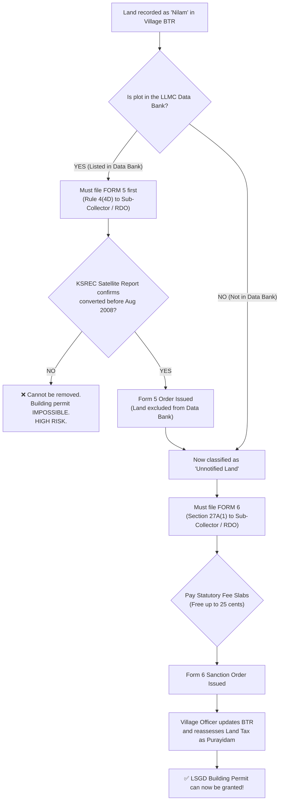

# Kerala Conservation of Paddy Land & Wetland Rules · Legal Diligence Reference

> **Governing Statutes & Amendments**:
> - **Kerala Conservation of Paddy Land and Wetland Act, 2008 (Act 28 of 2008)** — Effective 12 August 2008
> - **Kerala Conservation of Paddy Land and Wetland (Amendment) Act, 2018 (Act 29 of 2018)** — Introduced Section 27A & Sections 27B–27U
> - **Kerala Conservation of Paddy Land and Wetland Rules, 2008** & subsequent G.O.(P) notifications (including S.R.O. No. 167/2020 & 2021 fee revisions)

---

## 1. Statutory Classifications of Land in Kerala (ഭൂമി തരംതിരിവുകൾ)

Under Kerala revenue administration and the 2008 Act, real estate is strictly categorized. Discrepancies between physical appearance and revenue records are the #1 source of litigation and building permit denials.

| Classification | Malayalam Term | Legal Status under 2008 Act | Permissible Construction |
| :--- | :--- | :--- | :--- |
| **Purayidam / Garden Land** | പുരയിടം / കരഭൂമി | Free from 2008 Act restrictions; standard building rules (KMBR/KPBR) apply. | Standard residential and commercial buildings permitted. |
| **Paddy Land (Nilam)** | നിലം / വയൽ / നഞ്ച / പുഞ്ച | Cultivated with paddy or suitable for paddy cultivation; strictly protected under Section 3. | **NO construction permitted** without statutory exemption (Section 5/9/27A). |
| **Wetland** | തണ്ണീർത്തടം | Land inundated or saturated with water (marshes, swamps); absolute prohibition on reclamation under Section 11. | **Zero construction permitted**; absolute conservation. |
| **Unnotified Land** | ഡാറ്റാ ബാങ്കിൽ ഉൾപ്പെടാത്ത ഭൂമി | Land recorded as *Nilam* in BTR (Basic Tax Register) but converted prior to 12-08-2008 and **NOT included in the statutory Data Bank**. | Construction permitted **ONLY after obtaining Form 6 Order under Section 27A**. |
| **Data Bank Land** | ഡാറ്റാ ബാങ്കിൽ ഉൾപ്പെട്ട ഭൂമി | Land listed in the Gazette-published Local Level Monitoring Committee (LLMC) Data Bank as *Paddy Land* or *Wetland*. | No conversion possible without first removing from Data Bank via **Form 5 Application**. |

---

## 2. The Form 5 vs Form 6 Distinction (ഫോം 5 vs ഫോം 6 വ്യത്യാസം)

Buyers frequently confuse Form 5 and Form 6. Filing the wrong form or buying land in the wrong sequence leads to months or years of stalled permits:



### Form 5 (ഫോം 5 — ഡാറ്റാ ബാങ്ക് തിരുത്തൽ)
- **Statutory Provision**: Rule 4(4D) of Kerala Conservation of Paddy Land & Wetland Rules.
- **Purpose**: Removing land that was **wrongly included** in the finalized Data Bank as *Nilam* or *Wetland*, even though it was converted into garden land prior to 12 August 2008.
- **Key Evidence Required**:
  - **KSREC Report (Kerala State Remote Sensing and Environment Centre)**: Satellite imagery from 2008 or earlier proving existence of coconut trees, buildings, or dry land characteristics prior to Act commencement.
  - Agricultural Officer (കൃഷി ഓഫീസർ / LLMC Convener) inspection report.
- **Authority**: Revenue Divisional Officer (RDO) / Sub-Collector. Appeal lies before District Collector under Section 27B.

### Form 6 (ഫോം 6 — ബി.ടി.ആർ പുരയിടമാക്കൽ / 27A അനുമതി)
- **Statutory Provision**: Section 27A(1) of Act 28 of 2008 read with Rule 12.
- **Purpose**: Permission to use **Unnotified Land** (which is NOT in Data Bank, but still marked as *Nilam* in BTR) for residential, commercial, or non-agricultural purposes.
- **Outcome**: RDO issues proceedings allowing conversion. The Village Officer subsequently alters the classification in the **Basic Tax Register (BTR)** and reassesses land tax under the Kerala Land Tax Act, 1961.
- **LSGD Permit Prerequisite**: The local Panchayat or Municipality **cannot issue a building permit** until this Form 6 order is produced and BTR tax receipt reflects the new status.

---

## 3. Section 27A Fee Slabs & Exemption Rules (ഫീസ് വ്യവസ്ഥകൾ)

The Government of Kerala prescribes statutory conversion fees based on property extent and notified Fair Value (*ന്യായവില*):

| Extent of Unnotified Land | Statutory Fee Percentage | Special Concession / Notes |
| :--- | :--- | :--- |
| **Up to 25 Cents ($10.12\text{ Ares}$ / $\le 1,012\text{ m}^2$)** | **0% (100% FREE EXEMPTION)** | **₹0 fee** for applicants who own no other converted land in the same village / survey block. |
| **Above 25 Cents up to 50 Cents ($10.12\text{ to }20.23\text{ Ares}$)** | **10% of Fair Value** | 10% computed on the fair value of the land as notified under Section 28A of Stamp Act. |
| **Above 50 Cents up to 1 Acre ($20.23\text{ to }40.47\text{ Ares}$)** | **20% of Fair Value** | 20% of notified fair value for the plot extent. |
| **Above 1 Acre ($> 40.47\text{ Ares}$)** | **30% of Fair Value** | 30% of notified fair value + mandatory water conservancy pond provision. |

> [!IMPORTANT]
> **The 25-Cent Free Exemption Rule & Crucial Traps**:
> 1. **No Pro-Rata Deduction (Supreme Court 2025)**: Under the landmark Supreme Court ruling (*State of Kerala v. Landowner, 2025*), the 0% fee exemption applies **strictly only if the total holding is 25 cents or less**. If a plot is 28 cents, you **cannot** deduct 25 cents and pay for 3 cents—you must pay the 10% fee on the **entire 28 cents**!
> 2. **Anti-Fragmentation Cut-off (30 Dec 2017)**: Under G.O.(P) No. 1166/2020/Rev and clarifying circulars, the exemption is valid only if the parcel was $\le 25\text{ cents}$ as of **30 December 2017**. Land subdivided from larger units after this date is ineligible for the 0% fee.
> 3. **Decentralized Competent Authority (Act 12 of 2024)**: Applications under Section 27A (Form 6) and Data Bank exclusion (Form 5) are now processed by **Taluk-level Deputy Collectors across 71 taluks**, decentralizing authority from RDOs to clear backlogs.
> 4. An administrative application fee (₹1,000 via e-payment) applies to Form 6.

---

## 4. Water Conservancy & Drainage Mandate (ജലസംരക്ഷണ കുളം - Rule 12(9))

Where the extent of land for which conversion is sought under Section 27A **exceeds 50 cents (20.23 ares)**:
1. The applicant must mandatorily set apart **10% of the total land area for water conservation and rainwater retention** (a designated pond or water reservoir).
2. The water reservoir must be preserved perpetually and cannot be reclaimed, filled, or built upon.
3. If the plot is below 50 cents, suitable rainwater harvesting and natural flow drainage measures must be guaranteed in the site plan.

---

## 5. Dangerous Pitfalls & Traps for Kerala Land Buyers

### Trap 1: The "Physical Purayidam, Village Nilam" Scam (*നേരിട്ട് കണ്ടാൽ പുരയിടം, കരം രസീതിൽ നിലം*)
- **Scenario**: A seller shows a buyer a picturesque, level plot with 8-year-old fruit trees and a compound wall. The seller insists: *"See, it's dry high ground! The house next door was built 5 years ago."*
- **Legal Reality**: The seller's deed or Village Tax receipt states *"തരം: നിലം"* (Classification: Nilam). When the buyer applies for a building permit, the Panchayat Secretary issues a stop-memo under Section 14 of the 2008 Act.
- **Cost to Fix**: If the land is unnotified, obtaining a Form 6 order takes 6 to 18 months. If it is erroneously in the Data Bank, a Form 5 KSREC report is required first, adding another 9 to 24 months of bureaucratic delays and uncertainty.

### Trap 2: The Data Bank Rejection Nightmare
- If satellite imagery from KSREC shows that the land was paddy land/waterlogged in or around 2008, the RDO **will reject the Form 5 application**.
- Once Form 5 is rejected, the land is legally trapped as agricultural paddy land forever. You cannot build a house, cannot get electricity clearance, and cannot sell it except at agricultural distress valuations.

### Trap 3: Penal Restoration Orders under Section 13
- If anyone has filled a paddy land or wetland after August 2008 without statutory sanction:
  - The District Collector can order **forcible eviction and restoration of the land to its original paddy status at the owner's expense**.
  - Section 20 imposes **imprisonment up to 3 years and fines up to ₹5,00,000**.
  - Subsequent purchasers who bought after the landfilling are NOT immune; liability attaches to the registered owner.

---

## 6. Pre-Purchase Verification Checklist for Kerala Buyers

Before handing over token advance or signing an Agreement to Sell (*കരാർ*):

1. [ ] **Inspect the Village Tax Receipt (*കരം രസീത്*)**: Check the line stating `തരം` (Classification). If it says `നിലം` (Nilam), `നഞ്ച` (Nanja), or `തണ്ണീർത്തടം` (Wetland), treat as a critical red flag.
2. [ ] **Verify the LLMC Data Bank Status**: Visit the local Krishi Bhavan (*കൃഷിഭവൻ*) or check the online Revenue Data Bank portal to see if the survey number appears in the published Data Bank.
3. [ ] **Demand Form 5 / Form 6 Sanction Orders**: If the land was converted, ask the seller for the certified copy of the RDO's Section 27A order and the updated BTR extract (*ബി.ടി.ആർ തിരുത്തൽ പകർപ്പ്*).
4. [ ] **Check Extent Against 25 Cents**: If the plot exceeds 25 cents, calculate the 10%–30% Fair Value liability and verify who pays it before fixing the contract price.
5. [ ] **Do Not Rely on Adjoining Buildings**: An adjoining neighbor who built an unauthorized house or obtained an old permit before 2018 does not guarantee that your plot can be built upon today.
6. [ ] **Cross-Check Ente Bhoomi & ULPIN**: In villages under Kerala's Digital Resurvey (ILIMS), verify the plot's 14-digit ULPIN (Bhu-Aadhaar) and Unique Thandaper on `entebhoomi.kerala.gov.in` to match digital boundaries and d-BTR classification against physical ground stones.

---

## 7. Bilingual WhatsApp Inquiry Drafts (സെല്ലറോട് ചോദിക്കേണ്ട ചോദ്യങ്ങൾ)

Polite Malayalam questions for buyers to send sellers before committing funds:

### If the land has Nilam recitals:
```
നമസ്കാരം, സ്ഥലത്തിന്റെ പ്രമാണത്തിൽ/കരം രസീതിൽ 'നിലം' എന്ന് രേഖപ്പെടുത്തിയിരിക്കുന്നതായി കാണുന്നു. ഈ സ്ഥലം നിലവിൽ പഞ്ചായത്ത്/കൃഷിഭവൻ ഡാറ്റാ ബാങ്കിൽ (Data Bank) ഉൾപ്പെട്ടിട്ടുള്ളതാണോ? റവന്യൂ ഡിവിഷണൽ ഓഫീസിൽ (RDO) നിന്നും ഫോം 6 പ്രകാരം പുരയിടമാക്കി മാറ്റിയ ഉത്തരവും (Section 27A Order), വില്ലേജ് ബി.ടി.ആർ (BTR) തിരുത്തിയ രേഖയും ലഭ്യമാണോ എന്ന് ദയവായി വ്യക്തമാക്കാമോ?
```

### If the seller claims the land is exempt under 25 cents:
```
നമസ്കാരം, ഈ സ്ഥലം 25 സെന്റിൽ താഴെയാണെങ്കിലും, ഇതിന്റെ ബി.ടി.ആർ (BTR) പുരയിടമാക്കി മാറ്റുന്നതിനായി RDO ഓഫീസിൽ ഫോം 6 അപേക്ഷ സമർപ്പിച്ചിട്ടുണ്ടോ? ഇതിനുമുമ്പ് ഇതേ വില്ലേജിൽ മറ്റേതെങ്കിലും ഭൂമിക്ക് സൗജന്യ പരിവർത്തനം (25 cent fee exemption) എടുത്തിട്ടുണ്ടോ എന്ന് ദയവായി അറിയിക്കുമോ?
```
